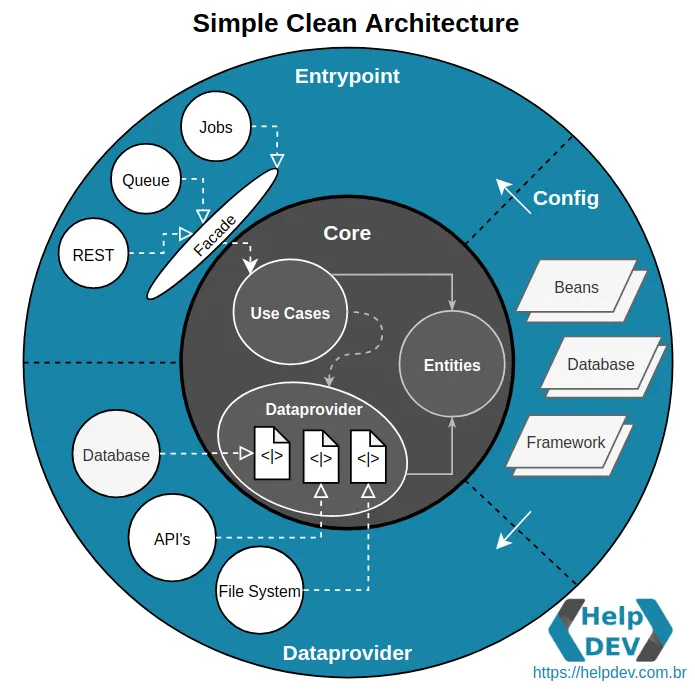

# clean-architecture
[](https://github.com/schambeck/clean-architecture/actions/workflows/gradle.yml)

# Simple Clean Architecture

With a more simplistic architectural vision, following all the good concepts, 
specially keeping total isolation of the core, but with a single external layer for the application, 
simulating a physically **modular** division into **packages** with *config*, *entrypoint* and *dataprovider*.



# Tech Stack
- Java 11
- Spring Boot
- PostgreSQL, Flyway
- JUnit 5, Mockito, JaCoCo

# Running project

## Start infra (PostgreSQL)
```bash
$ make compose-up
```

## Build artifact
```bash
$ make dist
```

## Run backend
```bash
$ make run
```

------------------------------------------------------------------------------------------
# API

#### Creating a notification
<details>
<summary><code>POST</code> <code><b>/notifications</b></code> <code>(creates a new notification)</code></summary>

##### Payload
```json
{
  "type": "SSE",
  "title": "Order created #1",
  "message": "Created at 2023-02-03",
  "link": "/orders/1"
}
```

##### Response
**Code** : `201 CREATED`
```json
{
  "id": "7c08629a-4d23-4b6d-9363-b0f0d7303aa4",
  "type": "SSE",
  "title": "Order created #1",
  "message": "Created at 2023-02-03",
  "link": "/orders/1",
  "read": false
}
```
</details>

------------------------------------------------------------------------------------------

#### Counting unread notifications
<details>
<summary><code>GET</code> <code><b>/queries/count-unread</b></code> <code>(counts unread notifications)</code></summary>

##### Response
**Code** : `200 OK`
```json
{
  "countUnread": 10
}
```
</details>

------------------------------------------------------------------------------------------

## References
- [Descomplicando a Clean Architecture](https://medium.com/luizalabs/descomplicando-a-clean-architecture-cf4dfc4a1ac6 "Simple Clean Architecture")
- [Uncle Bob Blog](https://blog.cleancoder.com/uncle-bob/2012/08/13/the-clean-architecture.html "")
- [Book: Clean Architecture: A Craftsman’s Guide to Software Structure](https://www.amazon.com.br/Clean-Architecture-Craftsmans-Software-Structure/dp/0134494164 "By Robert C. Martin")
- [Artigo: Criando uma aplicação modular muito além do Clean Architecture](https://medium.com/luizalabs/criando-uma-aplica%C3%A7%C3%A3o-modular-muito-al%C3%A9m-do-clean-architecture-5dde3687c5d6 "Modular Architecture")
